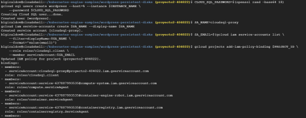
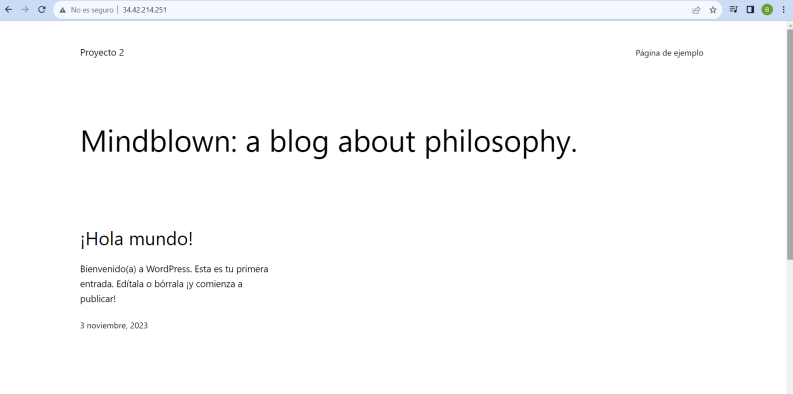

# ST02363 Tópicos Especiales en Telemática

# Estudiantes: Valentina Ochoa Arbooleda, vochoaa@eafit.edu.co
# Brigth Lorena Giraldo Vargas, blgiraldov@eafit.edu 
# Katherine Benjumena Ortiz, kbenjumeao@efit.edu.co

# Profesor: Edwin Nelson Montoya Munera, emontoya@eafit.edu.co

# Reto 4
#
# 1. breve descripción de la actividad
#
Desplegar la aplicación open source LAMP de comunidad que represente un sistema de información del tipo CMS (Content Management System) como Wordpress en ALTA DISPONIBILIDAD en un clúster de Kubernetes nativo en una nube. 

Se debe de crear el servicio de base de datos en HA dentro del clúster Kubernetes.
Tambien se debe de utilizar un servicio de base de datos administrado externo al clúster  "Cloud SQL" para comparar cual es mejor.

## 1.1. Que aspectos cumplió o desarrolló de la actividad propuesta por el profesor (requerimientos funcionales y no funcionales)

URL video: https://clipchamp.com/watch/Pu4tt05Ya8N

Se logró implementar la segunda opción utilizando el servicio de base de datos administrado externo al clúster "Cloud SQL".

## 1.2. Que aspectos NO cumplió o desarrolló de la actividad propuesta por el profesor (requerimientos funcionales y no funcionales)

URL video: https://clipchamp.com/watch/Hd5opRZ5u9B

No se pudo implementar el servicio de base de datos en HA.

1. Se crearon los manifiestos que eran necesarios para el despliegue.

-mysql-secret.yaml

-mysql-pv-pvc.yaml

-mysql-statefulset.yaml

-mysql-service.yaml

-wordpress-pv-pvc.yaml

-wordpress-deployment.yaml

Al momento de aplicar los manifiestos de mysql-pv-pvc.yaml se presenta un error con la ruta que no se lográ resolver para la entrega.

# 2. información general de diseño de alto nivel, arquitectura, patrones, mejores prácticas utilizadas.

Se tienen un cluster dentro de un Kubernet del servicio de GCP Cloud.

Se debe de utilizar la imagen de Wordpress para su despliegue.
Arquitecuta: El reto incorpora un diseño para una app monolítica.

Mejores prácticas: Implementación de contenedores.

# 3. Descripción del ambiente de desarrollo y técnico: lenguaje de programación, librerias, paquetes, etc, con sus numeros de versiones.

## como se compila y ejecuta.

Para la implementación de la base de datos administrada  externamente al clúster  "Cloud SQL", se crea el cluster y la instancia de MySQL por consola.

## detalles del desarrollo.

1. Creación del cluster

2. Creación de volúmenes 

3. Creación de instancia de MySQL para Wordpress

4. Implementación de Wordpress
    
Se crean los servicios y los secretos

Implementación de Wordpress

Exponer el servicio Wordpress

Wordpress funcionando

Se debe de realizar en el mismo orden.

## descripción y como se configura los parámetros del proyecto (ej: ip, puertos, conexión a bases de datos, variables de ambiente, parámetros, etc)

- Para la base de datos, se utiliza el puerto de Mysql 3306.

# referencias:

## https://engr-syedusmanahmad.medium.com/wordpress-on-kubernetes-cluster-step-by-step-guide-749cb53e27c7
## https://medium.com/@icheko/wordpress-high-availability-on-kubernetes-f6c0bcc2f28d
## https://matthewdavis.io/highly-available-wordpress-on-kubernetes 
## https://medium.com/codex/how-to-deploy-wordpress-on-kubernetes-part-1-62cc5bd74410
## https://medium.com/codex/how-to-deploy-wordpress-on-kubernetes-part-2-df1cc9cbaa2e

#### versión README.md -> 1.0 (2023-Septiembre)
